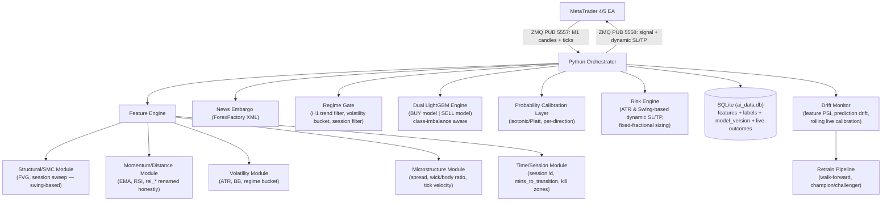

# PRD: MIA v4.0 — LightGBM-Driven XAUUSD Scalping System
**Status:** Draft for review
**Supersedes:** MIA v3.0
**Author context:** Rebuild informed by v3.0 live/historical diagnostics (BUY model collapse, SELL inverse-calibration finding, label-squashing leak, session-transition losses)

---

## 1. Problem Statement & Goals

MIA v3.0 proved the core architecture (ZMQ bridge, dual LightGBM engine, Triple Barrier labeling, news embargo) is sound, but live performance diverged sharply from backtest on the BUY side (11.7% live WR vs ~34% historical), and diagnostics surfaced a second, previously-hidden problem: SELL's own historical calibration curve is *inverted* (confidence anti-correlates with win rate). Several root causes were identified but never fixed:

1. Triple Barrier's 5-class label (`+1/-1/0/-2/-3`) is collapsed to binary `0/1` before training, discarding SOTW (stopped-out-then-win) information — disproportionately punishing BUY.
2. `dist_to_fvg` uses a `9999` sentinel instead of a proper missing-value representation.
3. `rel_m5/m15/h1` are mislabeled "Structure" when they are actually normalized momentum/distance features — this has been actively misleading feature-importance interpretation.
4. No dynamic SL/TP — fixed 40/60 pips regardless of volatility regime.
5. No walk-forward validation — single static 80/20 split, so regime-conditional instability (confirmed via the SELL inverse-calibration finding) went undetected.
6. No session-transition awareness, despite an observed empirical pattern of London-to-NY reversal causing correlated losses.
7. **Confirmed model version mismatch:** Historical `live_trades` aggregated 46 retrain iterations across 3 weeks, causing historical audit logs to compare multiple distinct model generations.
8. No class-imbalance handling in LightGBM despite a ~34% minority "win" class.

**Goal of v4.0:** Fix the above with minimal architectural upheaval — this is a targeted rebuild of the labeling, feature, validation, and calibration layers, not a rewrite of the ZMQ/execution plumbing that already works.

**Non-goals (explicitly out of scope for v4.0):**
- Order-flow / true traded-volume data (not available from retail MT4/5 feeds without a paid L2 add-on — flagged as a future consideration, not a v4.0 deliverable)
- Multi-instrument generalization (v4.0 stays XAUUSD-only)
- Full four-model regime/quality-grading architecture proposed by external review — deferred until the two-model system is properly calibrated and stable (see §9, Phased Roadmap)

---

## 2. Guiding Principles (non-negotiable this time around)

1. **Every feature must be independently sanity-checked before being trusted in the model.** No feature ships without (a) a "liveness rate" check (what % of bars does it fire on — flag anything >20–30% as likely too loose to be selective) and (b) a visual spot-check against real charts for structural features (FVG/OB/sweeps).
2. **Label information is never discarded before training without an explicit, logged decision.** The SOTW classes exist because they carry real information; every squashing/collapsing step must be justified and A/B tested against the alternative.
3. **No feature is labeled with trading jargon it doesn't actually implement.** ("Structure" must mean BOS/CHOCH, not price distance.)
4. **Validate BUY and SELL as if they were two separate research projects.** Symmetry is assumed nowhere — it's tested everywhere (identical code-path audits, independent calibration curves, independent walk-forward folds).
5. **Static single-split validation is banned.** Every model change is evaluated walk-forward, across at least 4–5 chronological folds, before being considered for live deployment.
6. **Model version is always traceable.** Every live prediction is logged with the exact model artifact hash/version that produced it — the "which model made this live trade" ambiguity from v3.0 must never recur.

---

## 3. System Architecture



Key changes from v3.0: a **Regime Gate** and **Calibration Layer** are now explicit pipeline stages (not buried inside `main_loop.py` as ad hoc thresholds), and a standing **Drift Monitor** feeds a formal **Retrain Pipeline**.

---

## 4. Feature Engineering Spec

### 4.1 Fixes to carry over from v3.0 (mandatory, not optional)

| Feature | v3.0 issue | v4.0 fix |
|---|---|---|
| `dist_to_fvg` | `9999` sentinel conflates absence with distance | Split into `has_fvg` (binary) + `fvg_dist_atr` (NaN when absent — LightGBM handles native NaN splits) |
| `rel_m5/m15/h1` | Labeled "Structure," is actually momentum/distance | Rename to `mom_dist_m5/m15/h1`. Category = "Momentum," not "Structure" |
| FVG / OB (if reintroduced) | No mitigation/expiry tracking | Add `mitigated` flag; once price trades back through, feature deactivates same-bar |
| Single-Candle OTE | Computed from single M1 candle high/low, not confirmed swing legs — pure noise | Replaced by multi-candle Swing High / Low detector (`get_swing_levels`, lookback=20) for dynamic SL/TP & sizing |

### 4.2 Full feature table (v4.0)

| Feature | Category | Formula / Logic | Notes |
|---|---|---|---|
| `atr_14` | Volatility | 14-SMA of True Range | Used to normalize nearly everything below |
| `bb_pctb`, `bb_bw` | Volatility | Standard Bollinger %B / bandwidth | unchanged from v3.0 |
| `rsi_14` | Momentum | Standard RSI | unchanged |
| `rsi_divergence` | Momentum | Price lower-low vs RSI higher-low (or inverse) over N bars | **new** — cheap, well-grounded addition |
| `stoch_k` | Momentum | Standard (14,3,3) | unchanged |
| `dist_ema_50`, `ema_50_slope` | Momentum | `(Bid-EMA)/ATR`; 5-bar ROC of EMA | changed: now ATR-normalized, not raw-price-normalized |
| `mom_dist_m5/m15/h1` | Momentum (renamed) | `(Bid - Close_TF)/ATR` | ATR-normalized instead of `/Bid`, and honestly labeled |
| `has_fvg`, `fvg_dist_atr` | Structural | See §4.1 | HTF (M15) only — M1 FVGs dropped, too noisy per earlier diagnosis |
| `swept_session_high`, `swept_session_low` | Structural (liquidity sweep) | Binary: price wicks through prior session's H/L and closes back inside within N bars | **new** — the one SMC concept with direct empirical support from the observed London→NY reversal pattern (§7) |
| `spread_atr_ratio` | Microstructure | current spread / ATR | unchanged, still important for cost filtering |
| `wick_body_ratio` | Microstructure | (upper+lower wick) / body size, current candle | **new** |
| `tick_volume` | Microstructure | M1 tick count fetched natively via MT4 `iVolume()` | **new**, replaces tick_velocity proxy |
| `session` | Time/Regime | categorical: ASIAN/LONDON/OVERLAP | unchanged (22:00 WIB cutoff enforced) |
| `mins_to_session_transition` | Time/Regime | continuous countdown to next session boundary | **new** — directly targets the session-reversal pattern |
| `minutes_since_red_folder` | Time/News | minutes elapsed since/until ForexFactory High-impact news (0-999) | **new** — teaches LightGBM post-news volatility dynamics |
| `hour_utc` | Time | unchanged | |
| `macro_bias` | Regime | slope-based BULLISH/BEARISH/NEUTRAL flag | unchanged, derived from EMA 50 slope |
| `volatility_regime` | Regime | categorical bucket from rolling ATR percentile (LOW/NORMAL/HIGH) | **new** — feeds dynamic SL/TP (§6) |
| `live_prob_buy/sell` | Audit only | model output | **hard rule: never joins the training feature set** (already correctly excluded in v3.0) |

### 4.3 SMC features explicitly deferred, not abandoned

- **Multi-candle Swing Leg Detection (`get_swing_levels`)**: INCLUDED in Phase 1 / Sprint 2. Evaluates 20-bar fractal Swing Highs ($\max$) and Swing Lows ($\min$) to calculate:
  1. Structural Dynamic Stop Loss (placed 2 pips beyond recent Swing High/Low).
  2. Dynamic Position Sizing: $\text{Lot Size} = \frac{\text{Risk Dollars}}{\text{SL Pips} \times \text{Pip Value}}$.
- **Single-candle OTE / Fib**: Single-candle OTE is dropped. Multi-candle Fibonacci Extensions (-27.2%, -61.8%) off fractal swing legs are used for structural Take Profit targets.
- **Order Blocks**: Deferred — needs mitigation tracking and a real swing-based definition, not just "last counter-candle before impulsive move" without invalidation logic.
- **BOS/CHOCH**: Not yet implemented in any version — genuinely deferred to a future phase (§9), since it requires proper swing-sequence logic.

---

## 5. Labeling & Target Definition

### 5.1 Triple Barrier — keep the mechanism, fix the mapping

Keep: pessimistic OHLC evaluation (assume SL hit first when a single candle's range breaches both), and the 5-class taxonomy (`+1/-1/0/-2/-3`).

**Fix the collapse.** Rather than the blanket `1 if label==1 else 0` used in v3.0, v4.0 uses:

- **Primary approach (Option A — exclusion):** Drop `-2` (Fast SOTW, ≤15 bars) rows from training entirely — these are noise-dominated and their inclusion as "losses" actively teaches the model to avoid setups that were directionally correct.
- `-3` (Slow SOTW) is **kept as a loss (`0`)** — by definition this was a real drift/timing miss even if eventually right, and including it as a loss keeps the model honest about entries that took too long to resolve.
- `0` (timeout) is **kept as a separate diagnostic dimension**, not folded blindly into losses — track timeout rate per direction/regime explicitly (this is likely to reveal fixed-time-barrier bias, see §5.2).
- This must be evaluated as an actual experiment, not assumed correct: train both the exclusion approach and a sample-weighted alternative (down-weight `-2`/`-3` rather than drop/keep-as-loss) and walk-forward compare. Whichever produces better-calibrated (not just higher-WR) live-simulated buckets wins.

### 5.2 Time barrier: consider direction-asymmetric horizons

Given XAUUSD's documented tendency to trend down faster than it grinds up ("stairs up, elevator down"), a single fixed 60-bar horizon likely disadvantages BUY setups specifically (more timeouts/SOTW). **Action item, not yet decided:** pull the timeout/SOTW rate split by direction (data now exists from the v3.0 diagnostic work) and test whether a longer horizon for BUY (e.g., 90 bars) closes the gap without degrading SELL.

### 5.3 Per-direction, not just per-model, evaluation discipline

Every labeling and validation change must report BUY and SELL metrics **separately**, never pooled — pooling was directly responsible for the inverse-calibration finding on SELL going unnoticed for as long as it did.

---

## 6. Risk & Execution Layer

- **Fixed-fractional position sizing** (0.5–1% equity risk per trade, e.g. $10 risk):
  - Lot size is calculated dynamically based on Stop Loss distance: $\text{Lot Size} = \frac{\text{Risk Dollars}}{\text{SL Pips} \times \text{Pip Value}}$.
  - Martingale explicitly banned at the architecture level (no lot-scaling-on-loss code path exists anywhere in the system).
- **Dynamic ATR & Swing-based SL/TP**, replacing static 40/60 pip targets:
  - `SL = max(k_sl × ATR_14, Swing_Boundary_Offset)`, `TP = k_tp × ATR_14` (or Fib expansion off swing leg).
  - Uses `get_swing_levels()` (lookback=20) to place SL 2 pips beyond recent Swing High/Low boundaries.
  - Directly addresses the v3.0 failure mode: fixed 60-pip TP too far in low vol (timeout decay), fixed 40-pip SL too tight in high vol (Fast SOTW).
- **Session throttle (22:00 WIB Cutoff)**: Suspend new entries in the **last 60 minutes of OVERLAP session (22:00–23:00 WIB)** to avoid low-liquidity spread bleed that wiped out London profits in v3.0.
- **News embargo**: unchanged from v3.0 (30m pre / 60m post high-impact ForexFactory events) — this was already correctly identified as a strength.
- **Regime gate**: the existing softened H1-trend filter is kept, but reframed as a first-class pipeline stage (§3) rather than an inline threshold buried in `main_loop.py`, and its threshold (`h1_threshold = 0.0015`) moves from hand-set to grid-searched (§8).

---

## 7. Model Architecture

- **Two independent LightGBM binary classifiers** (BUY / SELL) — retained. Rationale unchanged from original design docs: asymmetric market dynamics, independent thresholds, ambiguous-signal handling via "both high confidence → stay flat."
- **Class imbalance handling added** (`is_unbalance=True` or explicit `scale_pos_weight`) — missing in v3.0 despite a ~34%/66% win/loss split.
- **Regularization added explicitly**: `min_child_samples`, `num_leaves`, `lambda_l1/l2` all tuned via the same walk-forward harness (currently unset/default in v3.0 — a real overfitting risk given noisy financial labels).
- **Post-hoc probability calibration layer** (isotonic regression or Platt scaling), fit **separately per direction**, sitting between raw LightGBM output and the live threshold check. This is a direct, structural response to the discovered inverse-calibration finding on SELL and the flat/capped curve on BUY — rather than trusting raw `predict_proba` output as tradeable confidence, it gets recalibrated against actual realized outcomes before being thresholded.
- **Liquidity-sweep and session-transition features feed both models** (not a separate third model yet — see §9 for the deferred regime-classifier idea).

---

## 8. Validation & Experimentation Discipline

1. **Purged, embargoed walk-forward validation** replaces the static 80/20 split — minimum 4–5 rolling folds, each with an embargo gap (≥2x max label horizon, i.e. ≥120 bars given a 60-bar barrier) between train and test to prevent overlap leakage.
2. **Champion/challenger deployment**: no retrained model goes live directly. New models run in shadow mode (logged, not traded) against the incumbent for a pre-registered minimum trade count before promotion, with promotion criteria (e.g., calibrated expectancy must exceed champion's by a defined margin) set in advance, not decided post hoc.
3. **Calibration-bucket reporting is now a standard, automated part of every model evaluation** (not a one-off diagnostic) — win rate by probability decile, by direction, both on historical and live-shadow data, checked for monotonicity and confidence intervals (not just point estimates — the earlier report over-trusted small-n buckets like n=76).
4. **Model version logging**: every row in the live prediction/outcome table includes the exact model artifact hash. This closes the "was live and historical evaluation even using the same model" gap that couldn't be ruled out in the v3.0 postmortem.
5. **Hyperparameter and threshold search** (`h1_threshold`, probability cutoff, `k_sl`/`k_tp`) via grid or Bayesian search against the walk-forward harness, not hand-tuned during live debugging.
6. **Feature-level pre-registration**: before any new feature (especially structural/SMC ones) is added to the training set, log its liveness rate and, where applicable, a visual spot-check against charts — this check is now a checklist item in the PR/commit process, not an afterthought.

---

## 9. Phased Roadmap

**Phase 1 (this rebuild):**
Fix label collapsing, feature mislabeling/sentinel issues, add dynamic ATR-based SL/TP, walk-forward validation, per-direction calibration layer, session-transition + liquidity-sweep features, model-version logging, class-imbalance handling. Ship as MIA v4.0.

**Phase 2 (after v4.0 is stable in shadow mode for a full validation cycle):**
- Proper swing-based OTE/OB reintroduction, if the sweep feature proves out and there's appetite for more SMC surface area.
- BOS/CHOCH genuine structure-sequence detection.
- Direction-asymmetric time barriers if §5.2 investigation supports it.

**Phase 3 (exploratory, not committed):**
- Regime classifier as an explicit gating model ahead of BUY/SELL inference (the four-model architecture proposed in external review) — only worth pursuing once the two-model system's calibration is proven stable, given the data-starvation risk of further conditioning an already-thin trade sample.
- Tick-level order-flow proxies if a suitable data source becomes available.

---

## 10. Monitoring & Retraining (Live Operations)

- **Retrain cadence**: weekly/bi-weekly rolling-window retrain, each validated through the full walk-forward harness before challenger promotion.
- **Drift monitoring**, three layers:
  - *Feature drift*: rolling PSI per feature vs. training distribution.
  - *Prediction drift*: rolling distribution of output probabilities per direction (catches indecisive-clustering before P&L shows it).
  - *Performance/concept drift*: rolling realized win rate and expectancy per direction vs. a statistically-bounded control band (not eyeballed).
- **Escalation ladder** on drift trigger: reduce size → halt new entries (open positions manage out) → full stop + forced re-validation, in that order, never a single-step kill switch.
- **Full audit logging retained and extended**: every prediction, full feature vector, realized outcome, and model version — this is what made the entire diagnostic process in this document possible, and it stays non-negotiable.

---

## 11. Open Questions (explicitly unresolved, need investigation before Phase 1 is "done")

1. Does a direction-asymmetric time barrier close the BUY/SELL timeout gap, or is a fixed horizon fine once SOTW-handling is fixed?
2. Are the BUY and SELL feature/execution code paths verified symmetric (spread handling, FVG detection mirroring, etc.) — this audit was recommended but not yet completed as of this document.
3. Was the SELL inverse historical calibration finding ever explained (model-version mismatch? regime-specific? sample artifact?) — flagged as high-priority, unresolved.
4. What does XAUUSD's actual price/`macro_bias` distribution look like over the specific live-trading window that produced the 11.7% BUY WR — needed to confirm or refute the regime-drift narrative directly rather than inferring it.

---

## 12. LLM Integration (Supplementary, Not Core Inference)

LightGBM remains the sole live decision-making model. LLMs are deliberately kept **out of the hot path** (ZMQ tick/candle loop) and are used only where their strengths — unstructured text understanding, slow-cadence reasoning, natural-language summarization — apply. Every LLM output that touches the trading system does so as a logged, versioned *feature* or *alert*, never as a direct trade trigger.

### 12.1 Where an LLM fits

| Use case | Cadence | Integration point | Output |
|---|---|---|---|
| **News/event feature extraction** | Event-driven (on new ForexFactory release / scheduled macro print) | New async service, writes to feature store | `hawkish_dovish_score`, `surprise_magnitude`, `headline_sentiment` — structured, numeric/categorical, joined into the existing feature table like `macro_bias` |
| **Trade post-mortem / diagnostic assistant** | Batch (daily/weekly) | Offline, reads from the audit DB (features + labels + outcomes) | Natural-language cluster summaries of losing trades (e.g., regime/feature co-occurrence patterns) — research aid, not a pipeline component |
| **Regime/narrative context feature** | Slow (hourly/daily) | Feature store, alongside `macro_bias` | Categorical feature (e.g., "risk-off," "gold safe-haven bid") derived from recent financial news summaries — speculative, must be walk-forward tested like any other new feature before trusting it |
| **Development/ops copilot** | N/A (build-time, not runtime) | Outside the trading system entirely | Assists writing feature code, the walk-forward harness, and PR review — highest-value, lowest-risk use case since it never touches live decisions |
| **Drift-monitor alert summarization** | Triggered by existing drift monitor (§10) | Sits downstream of the rule-based escalation ladder | Human-readable explanation of a drift alert — communication layer only, does not itself gate or trigger the escalation actions |

### 12.2 Explicit non-fits (why LLMs are excluded from these)

- **Per-tick/per-candle direction prediction**: LLM inference latency is orders of magnitude too slow for M1 scalping, and LLMs are not calibrated numeric probability estimators the way a tuned LightGBM classifier is.
- **Triple Barrier labeling or technical feature computation**: these must be deterministic and exactly reproducible bar-by-bar for backtesting; LLM calls are neither fast nor guaranteed deterministic.
- **Direct trade execution decisions**: no LLM output is ever allowed to trigger a buy/sell without passing through the same deterministic Regime Gate, Calibration Layer, and Risk Engine (§3, §6, §7) as every other feature — hallucination risk in a live-money system is unacceptable without a bounded, auditable filter around it.

### 12.3 Implementation notes

- The news-sentiment service runs independently of the ZMQ hot loop and writes into the same feature store the Feature Engine already reads from — architecturally identical to how `macro_bias` is currently produced, just with an LLM-based producer instead of a price-slope calculation.
- All LLM-derived features are subject to the same feature pre-registration discipline as everything else in this PRD (§8, item 6): liveness-rate check, and walk-forward validated for actual predictive lift before being trusted in the live model — an LLM-derived feature is not exempt from proving itself just because it's novel.
- Every LLM call (prompt, model/version, raw output, parsed structured output) is logged in the audit DB alongside the resulting feature value, for the same reproducibility/debuggability reasons the rest of this system is logged so thoroughly.

---

## Appendix: Minimum Schema Additions Needed for v4.0

```
signals / snapshots table additions:
  - model_version_hash (text, not null)
  - volatility_regime (enum: LOW/NORMAL/HIGH)
  - mins_to_session_transition (float)
  - has_fvg (bool), fvg_dist_atr (float, nullable)
  - swept_session_high (bool), swept_session_low (bool)
  - wick_body_ratio (float)
  - tick_velocity (float)
  - calibrated_prob_buy, calibrated_prob_sell (float, post-calibration-layer output, distinct from raw model output)
  - raw_label (int: +1/-1/0/-2/-3, retained pre-collapse for future re-analysis)

llm_features table (new, §12):
  - event_id / timestamp
  - source_type (enum: NEWS_RELEASE / NARRATIVE_SUMMARY)
  - llm_model_version (text, not null)
  - raw_prompt, raw_output (text, for audit/reproducibility)
  - hawkish_dovish_score, surprise_magnitude, headline_sentiment, narrative_regime (nullable, populated per source_type)
```
